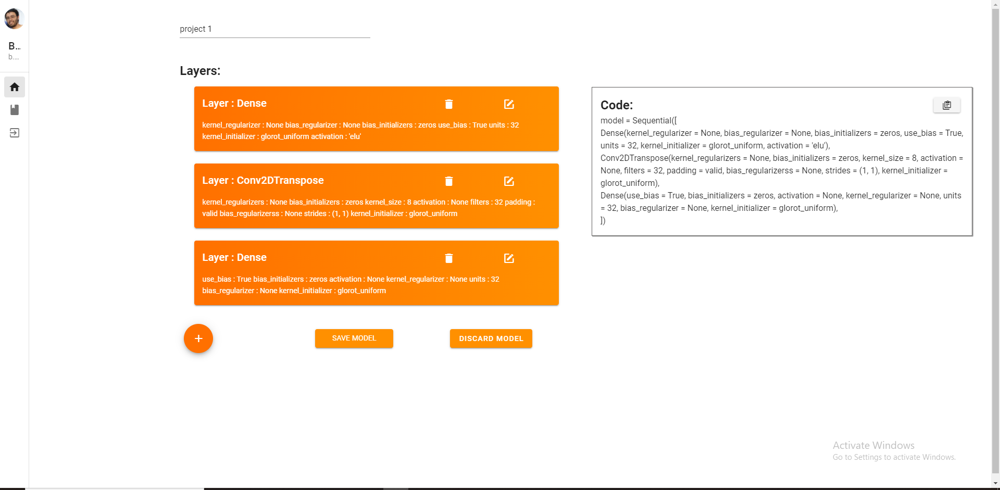
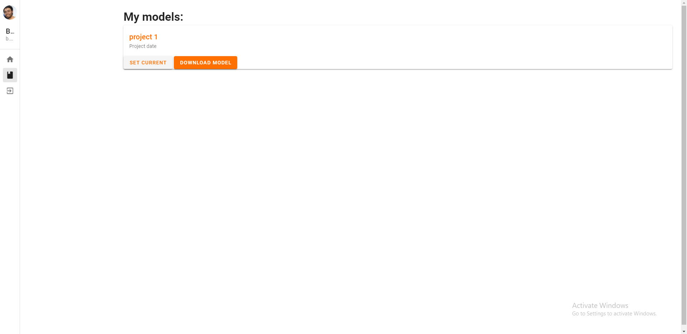

# Tensorflow Model Generator
### [View web app](https://tensorflow-model-generator.vercel.app/)  

This is a web app which gives the user access to a custom formset which he can fill according to his needs and generate the respective tensorflow sequential API code.  
We also provide an interface to store these models so that they can be used again or edited in the future.  
It also serves as a PWA.

 

  

 

  
